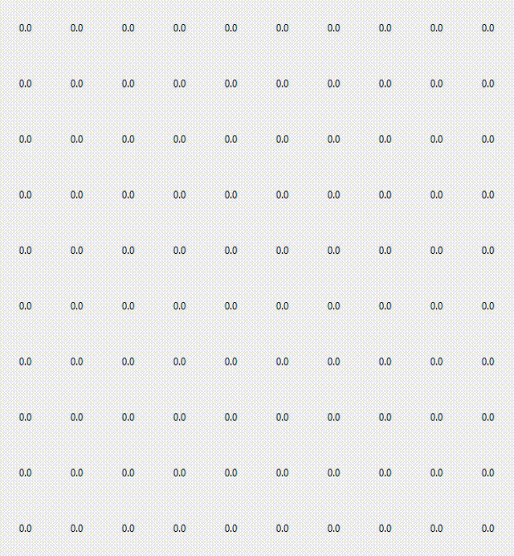

# learn_RL


## Policy evaluation

Replication of `REINFORCEjs` for personal interest:
```
https://cs.stanford.edu/people/karpathy/reinforcejs/gridworld_dp.html
```

Run the program by
```
python policy_evaluation.py
```

Result will be visualized in simple heatmap:




#### Default configuration:

| Attribute | Value | Description |
|-----------|-------|-------------|
|ROW|10|-|
|COL|10|-|
|GAMMA|0.9|Discount factor|
|ACTION_DIM|4|Dimension of actions for probablity calculation|
|CONV|0.001|Threshold for convergence, calculated based on the sum difference with previous sweep|
|MAX_ITER|10000|Maximum iteration attempt for reaching convergence|
|LOOP_MS|0.1|Refresh second for each sweep|
|PRECISION|3|Precision used to calculate difference (for flashing color ONLY)| 

#### Special considerations:

`Start State: [0][0], Goal State: [5][5]`
1. If the next state `(s')` hits the wall, stay action will be performed and the reward for next state will be equal to starting state `(s)`
2. If the `state == Grid[5][5] (i.e. Goal State)`, all the reward for next state will be referred to `Grid[0][0] (i.e. Start State)`.
